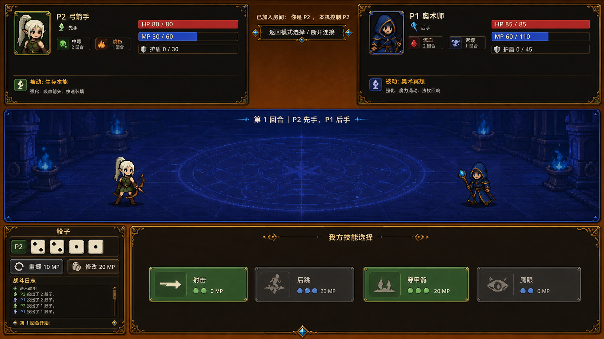

# 正式版界面开发计划

本文档用于跟踪 Dice Fight UI 从 demo 级操作界面升级为准正式版奇幻像素战斗界面的全部工作。目标方向参考用户提供的效果图：暗色奇幻像素风、金色装饰边框、蓝色地下城竞技场、左右大型玩家 HUD、骰子区、嵌入式战斗日志、横向技能卡。

## 信息源

- 玩法规则来源：`docs/GAME_DESIGN.md`
- 架构与 UI 要求来源：`docs/TECH_DESIGN.md`
- 项目协作与进度规则：`AGENTS.md`
- 目标视觉方向：暗黑奇幻像素对战 UI，包含金色装饰框、蓝色地下城竞技场、大型玩家 HUD、骰子托盘、嵌入式战斗日志、横向技能卡。
- 参考图建议路径：`docs/references/formal_ui_mockup.png`

UI 工作必须保持在表现层。UI 可以渲染 battle snapshot、提交 command、播放 presentation events，但规则结算仍属于 `scripts/rules/`，LAN 主机权威逻辑仍属于 `scripts/network/`。

## 参考图管理

状态：`[todo]`

建议将目标效果图作为仓库内固定参考图保存到：

```text
docs/references/formal_ui_mockup.png
```

文档中保留固定引用位置：

```markdown

```

参考图的作用不是要求像素级复刻，而是固定以下质量目标：

- 信息布局：顶部双 HUD、中间竞技场、底部骰子/日志/技能区。
- 视觉层级：角色状态和可行动按钮优先，日志辅助。
- 美术语言：暗色底、金色边框、蓝色战场、像素奇幻角色。
- 控件形态：资源条、状态徽章、骰子面、技能卡、网络状态面板。
- 可读性：中文文本、数值、按钮状态在目标分辨率下清楚可见。

如果参考图后续更新，必须在本节记录更新原因，避免开发中途目标漂移。

## 当前基线

最后检查日期：2026-05-24。

- Milestone 1 本地热座规则 demo 已实现。
- Milestone 2 LAN Host/Join 基础已实现。
- Milestone 3 第一版 UI 正在推进中。
- 主流程已存在：主菜单、角色选择、强化选择、战斗、交互判定、游戏结束、再战。
- 现有 UI 场景位于 `scenes/ui/`，脚本位于 `scripts/ui/`。
- 战斗界面已经有可复用的高层结构：顶部 HUD 区、中部竞技场区、底部行动/日志区。
- 占位角色头像、技能图标、状态图标和部分角色动画路径已经存在。
- 战斗界面样式已切换到共享 Theme 与 `BattleScreen._apply_formal_styles()`，但竞技场背景仍是程序化/占位式正式风格，后续可替换为最终美术。
- 骰子已由 `DiceTray` 与 `DieFace` 渲染，当前使用第一版 SVG 骰子面与隐藏骰子背面。
- 主菜单、角色选择、强化选择和结算界面仍然像 demo/控制台界面。
- 创建本计划时工作区干净，但本地 `main` 比 `origin/main` 落后 1 个提交。

## 目标结果

正式版战斗界面需要在结构和意图上接近目标效果图：

- 顶部左侧和右侧是玩家 HUD 面板，显示头像、先后手、HP、MP、护盾、状态、被动和强化。
- 顶部中间是网络/房间状态面板，包含房间状态与主题化返回/断开按钮。
- 中部是完整横向竞技场，包含像素地下城背景、蓝色魔法地面、回合标题、左右角色站位。
- 底部左侧是骰子与战斗日志面板，包含骰子面、重掷/改点操作和紧凑可滚动日志。
- 底部右侧是技能选择面板，包含大型横向技能卡、图标区、骰子需求标记、MP 消耗、可用/禁用状态。
- 全局统一暗黑奇幻像素风：深色面板、金色描边、装饰角、可读中文文本、清晰信息层级。
- 玩家不看战斗日志也能理解主要战斗变化。

## 状态标记

- `[todo]` 尚未开始。
- `[doing]` 正在进行。
- `[blocked]` 被美术资源、设计决策或实现依赖阻塞。
- `[done]` 已实现并通过验证。

## 2026-05-25 截图对比后的当前修改方向

本节记录基于“当前游戏界面截图”和“目标效果图”的系统评估结论，用于指导后续 AI 或人工开发。当前版本已经具备正确的战斗界面骨架：顶部双 HUD、中部竞技场、底部骰子/日志/技能区、LAN 状态面板和技能选择面板均已存在，因此后续不应推倒重做，而应在现有 `scenes/ui/` 组件和 `scripts/ui/` 渲染逻辑上持续精修。

### 总体结论

当前界面仍偏开发调试型 UI：绿色/蓝色描边明显、头像和状态权重偏低、技能区空白较多、角色在竞技场中的存在感不足、状态和战斗变化主要依赖日志理解。目标效果图则是正式战斗信息界面：暗色奇幻像素风统一，金色装饰边框明确，角色 HUD 信息密集但有层级，技能卡紧凑，状态徽章和资源变化可以一眼读懂。

后续开发重点是把“功能已经可用”升级为“信息清楚、反馈明确、风格统一”。验收标准不是像素级复刻目标图，而是玩家在不读完整战斗日志的情况下，也能看懂当前先后手、双方资源、关键状态、可用技能和刚发生的战斗变化。

### 优先修改方向

1. 状态徽章与 HUD 精修优先。
   - 推进工作流 8，让 guard、immune、sure evasion、poison、cold、burn、fire shield、eagle eye、flame tide、frost tide、ice wind、static cage、Pyromancer rebirth 等关键状态具有正式图标、层数/回合角标和清晰 tooltip。
   - 顶部 HUD 应继续接近目标图的信息层级：头像更像角色身份入口，HP/MP/护盾条更醒目，先后手、被动、强化、状态流不互相挤压。
   - 多状态同时存在时，优先保证可读性，不为了装饰牺牲层数和回合数。

2. 竞技场角色与表现事件继续推进。
   - 推进工作流 9，让角色真正站在背景上：增加底部阴影或底座、统一左右站位比例、保证角色名不遮挡角色。
   - 优先实现伤害、治疗、护盾、状态添加/移除、免疫、闪避、死亡保护等 presentation event 的轻量反馈：浮字、短闪、高亮、轻微位移或抖动。
   - 缺少动画资源时必须安全 fallback 到 idle/静态立绘，不允许 presentation event 导致脚本错误。

3. 技能卡二次压缩和可读性增强。
   - 当前技能区功能已经可用，但目标效果要求更紧凑、更像横向技能卡。卡片应优先展示图标、技能名、骰子需求、MP 消耗、可用/禁用状态。
   - 禁用原因不能只藏在 tooltip；至少要在卡片上有简短可见提示，tooltip 再提供完整说明。
   - 热座模式下 P1/P2 行动面板可以并排，但每个技能卡应避免过高、过宽或大面积空白。

4. 战斗日志降级为辅助理解，而不是主要理解入口。
   - 日志仍然是调试和规则解释的重要表面，不能移除。
   - 但关键战斗结果必须同步体现在 HUD、状态徽章、角色反馈或浮字上。
   - LAN 隐私过滤仍需保持：客户端不能看到对手骰子、待提交行动和私密 submit/reroll/modify 日志。

5. 全流程界面正式化排在主战斗体验之后。
   - 工作流 10 仍需推进：主菜单、角色选择、强化选择、结算界面不能长期停留在 demo/控制台风格。
   - 但在资源有限时，优先把战斗主界面做到可展示，再统一其他流程界面。

### 实施边界

- UI 只渲染 snapshot、提交 command、消费 presentation events，不在按钮回调里写伤害、MP、护盾、骰子或状态结算。
- LAN 主机权威、完整 snapshot 同步和私密信息隐藏规则不因视觉改造而改变。
- 新增图标、头像、背景、音频路径必须安全 fallback；JSON 资产路径仍然可选。
- 从 JSON、Dictionary、snapshot 或其他 `Variant` 来源取值时继续避免 `:=`。
- 每个重要 UI 改动结束后，按工作流 13 运行最小相关验证，并检查 `git status --short --branch`。

## 工作流 1：视觉规格冻结

状态：`[done]`

最后更新时间：2026-05-24。

### 需要结果

- 冻结第一版正式 UI 美术方向。
- 确定 UI 缩放目标，首版以 16:9 桌面视口、1920x1080 构图为参考。
- 确定 UI 美术资源命名规则。
- 确定共享色板与边框语言：深色面板、金色描边、蓝色竞技场强调色、危险红、法力蓝、护盾灰、中毒绿/紫、灼烧橙。
- 决定当前 playable slice 之外的数据角色是否显示、隐藏或标注为开发中。

### 实施过程

1. 在本文档中明确视觉关键词。
2. 决定目标视口和最低支持分辨率。
3. 在导入资源前创建资产命名规则。
4. 决定 UI 当前只支持 Swordsman、Archer、Witch Doctor、Pyromancer，还是同时显示 Arcanist、Stormcaller、Vampire 等数据角色。

### 验收标准

- 美术方向足够具体，后续开发者新增面板或按钮时不需要重新发明风格。
- 角色显示范围决策已记录。
- 不需要更改规则或网络代码。

### 冻结规格

#### 视觉关键词

- 核心风格：暗黑奇幻、像素战斗 UI、地下城竞技场、金色装饰边框、蓝色魔法地面、清晰资源读数。
- 画面情绪：紧张、古典、带少量奥术感；避免明亮卡通、现代科幻、纯扁平仪表盘或过度霓虹。
- 信息层级：玩家 HUD 与当前可行动区优先；骰子和技能卡其次；战斗日志作为解释与调试辅助。
- 形状语言：厚重深色面板、细金描边、切角或装饰角、低饱和暗底、高亮边缘、像素感图标。
- 文本原则：中文可读优先，标题短、数值醒目、说明文本压缩到可扫读长度。

#### 目标视口与缩放

- 主目标：16:9 桌面视口，`1920x1080` 构图。
- 首版最低人工检查分辨率：`1366x768`。
- 常见降级检查分辨率：`1600x900`。
- 首版不承诺移动端竖屏布局；小窗口支持以 16:9 可读性为准。
- UI 布局优先使用容器、最小尺寸和锚点约束，避免用硬编码像素堆出只适配单一分辨率的界面。
- 固定格式控件建议尺寸：
  - 顶部 HUD：左右各占主要宽度，中间留网络/房间状态条。
  - 竞技场：中部横向主视觉，保留左右角色站位和中心回合标题。
  - 底部区域：左侧骰子与日志，右侧技能卡；技能卡应能横向堆叠或纵向滚动降级。

#### 共享色板

| 语义 | 建议颜色 | 用途 |
| --- | --- | --- |
| 深色背景 | `#10131A` | 全局底色、屏幕背景 |
| 面板底色 | `#1B2130` | HUD、日志、技能区主面板 |
| 面板内层 | `#252C3D` | 卡片、输入框、局部容器 |
| 金色描边 | `#C9973F` | 面板边框、标题栏、重点分隔线 |
| 暗金阴影 | `#6F4B1E` | 装饰角、按下态、边框暗部 |
| 竞技场蓝 | `#2F7FD8` | 魔法地面、竞技场高亮 |
| 奥术青 | `#47C7D9` | 可交互高亮、选中描边 |
| 危险红 | `#D84A3A` | HP、失败、伤害提示 |
| 法力蓝 | `#3D8BFF` | MP、法术资源 |
| 护盾灰 | `#9AA7B8` | 护盾条、格挡提示 |
| 中毒绿 | `#55B85A` | 中毒状态、持续伤害 |
| 诅咒紫 | `#8B5CC7` | 巫医/灵魂类状态 |
| 灼烧橙 | `#F07A2A` | 灼烧、火焰技能 |
| 禁用灰 | `#5D6470` | 禁用按钮、隐藏信息 |
| 正文浅色 | `#E8E2D6` | 主要文字 |
| 次级文字 | `#B8B0A3` | 说明、日志次级内容 |

#### 边框与控件语言

- 面板：深色填充、1-2px 金色描边、内层暗边，关键面板可加装饰角。
- 按钮：默认暗金/深蓝底，悬停提高亮度，按下加深并轻微内陷，禁用降低饱和度但保留可读文字。
- 资源条：HP 红、MP 蓝、护盾灰；条内或条旁必须显示 `当前/最大` 数值。
- 状态徽章：小型方形或圆角徽章，状态图标优先于文字，层数/回合数显示在角标。
- 骰子：浅骨色或冷灰骰面、深色点数、金色或蓝色选中描边；隐藏骰子使用背面或暗色问号样式。
- 技能卡：横向卡片，左侧图标，中部名称与需求，右侧 MP/模式/禁用原因；禁用原因不能只藏在 tooltip。
- 日志：嵌入式深色面板，金色标题栏，正文紧凑；重要事件可用语义色点缀，但不要取代规则日志文本。

#### 资产命名规则

新增 UI 资产统一放在 `assets/ui/` 下；工作流 2 创建目录前，先按以下命名冻结：

```text
assets/ui/backgrounds/bg_<scene_or_screen>_<variant>.png
assets/ui/frames/frame_<component>_<variant>.png
assets/ui/panels/panel_<component>_<state>.png
assets/ui/buttons/btn_<action_or_kind>_<state>.png
assets/ui/dice/die_<face_or_back>_<variant>.png
assets/ui/icons/icon_<domain>_<name>.png
assets/ui/fonts/font_<family_or_role>.<ext>
assets/ui/theme/dice_fight_theme.tres
```

命名约束：

- 文件名使用小写英文、数字和下划线。
- 状态后缀统一使用 `normal`、`hover`、`pressed`、`disabled`、`selected`、`hidden`。
- 角色或技能专属 UI 资产使用数据 ID 作为名称片段，例如 `icon_skill_pyromancer_fireball.png`。
- 可复用装饰资产不绑定屏幕名，例如 `frame_gold_corner_normal.png`。
- JSON 中已有的角色、技能、状态路径继续可选；缺失或空路径必须安全 fallback。

#### 角色显示范围决策

当前正式 UI 首版显示并支持 AGENTS.md 中列出的 playable slice：

- Swordsman
- Archer
- Witch Doctor
- Pyromancer
- Frost Swordsman
- Arcanist
- Vampire
- Stormcaller

决策说明：

- 这些角色均属于当前可玩切片，正式 UI 不应只展示早期 4 人子集。
- 如果数据目录中存在 playable slice 之外的历史或实验角色，角色选择 UI 默认隐藏；如必须展示，需明确标注“开发中”，且不能影响当前主流程 smoke tests。
- 角色显示范围只是表现层决策，不改变角色数据、规则结算或网络同步。

#### 工作流 1 备注

- `docs/references/formal_ui_mockup.png` 当前已存在，可作为后续工作流的构图参考。
- 本工作流只冻结规格，没有修改 `scenes/ui/`、`scripts/ui/`、`scripts/rules/` 或 `scripts/network/`。
- 后续工作流 2 才创建 `assets/ui/` 目录、Theme 和实际 UI 资产。

## 工作流 2：资产与 Theme 基础

状态：`[done]`

最后更新时间：2026-05-24。

### 需要结果

创建或填充以下目录：

```text
assets/ui/backgrounds/
assets/ui/frames/
assets/ui/panels/
assets/ui/buttons/
assets/ui/dice/
assets/ui/icons/
assets/ui/fonts/
assets/ui/theme/
assets/ui/theme/dice_fight_theme.tres
```

Theme 至少覆盖：

- `Button`
- `PanelContainer`
- `Label`
- `LineEdit`
- `TextEdit`
- `ProgressBar`
- `ScrollBar`
- Tooltip/Popup 样式，在可行范围内覆盖

### 实施过程

1. 添加 UI 资产目录结构。
2. 导入或生成第一版正式 UI 资产。
3. 创建 `dice_fight_theme.tres`。
4. 将 Theme 应用到主 UI 根节点或各个屏幕根节点。
5. 保持 `UIAssets.texture_from_path()` 的 fallback 行为，确保 JSON 里的可选资源路径为空时仍然安全。

### 验收标准

- 可选美术路径为空时，项目不会出现缺失资源错误。
- 应用 Theme 后，现有 UI smoke tests 通过。
- 不提交 `.godot/` 生成缓存。

### 工作流 2 备注

- 2026-05-25 生成第一组可复用暗黑奇幻像素 UI PNG 资产：`panel_dark_gold_normal.png`、厚重按钮 normal/hover/pressed/disabled、像素头像框、状态徽章框、资源条外框、技能卡 normal/disabled 和金色角花；源图使用无文字、无数字、品红色键背景提示词生成，落地后裁切为透明 PNG。
- 2026-05-25 `dice_fight_theme.tres` 已接入按钮、`PanelContainer` 和 `ProgressBar` 背板的 `StyleBoxTexture`；`UIAssets` 新增贴图 `StyleBox` helper，并保留缺失图片时的 `StyleBoxFlat` fallback。
- 已创建 `assets/ui/` 目录结构，并添加 `assets/ui/theme/dice_fight_theme.tres`。
- 第一版正式 UI 骰子面 SVG 已放入 `assets/ui/dice/`，其余资产目录保留给后续正式美术。
- `scenes/main/main.tscn` 已应用共享 Theme；`UIAssets.texture_from_path()` fallback 行为保持不变，并补充共享色板/面板样式 helper。
- 未修改规则或网络代码。

## 工作流 3：战斗界面布局重构

状态：`[done]`

最后更新时间：2026-05-24。

主要文件：

- `scenes/ui/screens/battle_screen.tscn`
- `scripts/ui/screens/battle_screen.gd`

### 需要结果

- 用目标效果图布局替代当前占位三段式视觉。
- 顶部区域包含左侧 HUD、中间网络状态面板、右侧 HUD。
- 中央竞技场使用真实背景图或分层场景美术，不再显示 `"场景"` 占位 Label。
- 底部区域像目标图一样分为骰子/日志区与技能卡区。
- LAN 隐私规则保持不变：客户端看不到对手骰子、待提交行动和私密日志。

### 实施过程

1. 先重排 `battle_screen.tscn` 的布局。
2. 用 Theme 和正式组件替换 `_apply_placeholder_styles()`。
3. 保持 `_render_*` 方法专注于 snapshot 到 UI 的渲染。
4. 保留现有 signal 和 command 提交流程。
5. 布局变更后检查本地热座与 LAN 显示假设。

### 验收标准

- 战斗界面在 16:9 下接近目标效果图构图。
- UI 回调中不新增规则逻辑。
- 行动提交与交互判定流程仍然可用。
- UI smoke tests 和 Godot 启动/debug 检查通过。

### 工作流 3 备注

- 已重构 `battle_screen.tscn` 的构图比例，保留顶部双 HUD、中间网络状态、中央蓝色竞技场、底部骰子/日志与技能区。
- `BattleScreen._apply_placeholder_styles()` 已替换为 `_apply_formal_styles()`，中心占位 `"场景"` 文本改为正式竞技场标题。
- `_render_*` 方法仍只渲染 snapshot、提交 command 或播放表现事件；LAN 隐私过滤逻辑保持在原有 UI 过滤边界内。
- 2026-05-24 修复首版正式布局的缩放问题：压缩顶部 compact HUD、降低竞技场/底部最小高度，并为技能区加入纵向滚动，避免 16:9 视口下状态栏和技能列表越界。
- 未修改规则或网络代码。

## 工作流 4：角色 HUD 组件

状态：`[done]`

最后更新时间：2026-05-24。

当前主要组件：

- `scenes/ui/components/player_state_panel.tscn`
- `scripts/ui/components/player_state_panel.gd`

建议新增或替换为：

```text
scenes/ui/components/character_hud.tscn
scripts/ui/components/character_hud.gd
```

### 需要结果

- 带角色美术的头像框。
- 玩家编号、角色名、先手/后手标记。
- 符合目标图风格的 HP、MP、护盾条。
- 状态徽章行，显示层数/回合数。
- 被动区与强化摘要区。
- LAN 客户端隐藏对手私密行动。

### 实施过程

1. 决定是演进 `PlayerStatePanel`，还是替换为 `CharacterHud`。
2. 如果布局需要，抽取可复用 `resource_bar`。
3. 保持 `set_player(player_id, battle, animate, hide_private_info)` 或等价 snapshot 渲染 API。
4. 使用现有状态和角色数据，不在 HUD 里复制规则。

### 验收标准

- HUD 展示的信息不低于当前面板，但视觉层级更清楚。
- 多个状态同时存在时仍然可读。
- 被动和强化文本在目标分辨率下不溢出。

### 工作流 4 备注

- 本轮选择演进 `PlayerStatePanel`，未新增 `CharacterHud`，以减少主战斗屏接线变更。
- HUD 已加入头像框、角色/先后手信息、HP/MP/护盾资源条、状态流式徽章、被动/强化/行动摘要。
- `set_player(player_id, battle, animate, hide_private_info)` API 及测试使用的 `role_label`、`status_row` 保持可用。
- LAN 对手私密行动继续显示为隐藏状态，不暴露待提交行动。

## 工作流 5：骰子托盘与骰子面

状态：`[done]`

最后更新时间：2026-05-24。

当前主要组件：

- `scenes/ui/components/dice_view.tscn`
- `scripts/ui/components/dice_view.gd`

建议新增组件：

```text
scenes/ui/components/dice_tray.tscn
scripts/ui/components/dice_tray.gd
scenes/ui/components/die_face.tscn
scripts/ui/components/die_face.gd
```

### 需要结果

- 1 到 6 点的正式骰子贴图。
- 类似目标图中 `P2` 的玩家标签。
- LAN 隐私用的空/隐藏骰子状态。
- 重掷反馈动画。
- 为后续改点 UX 预留选中态。

### 实施过程

1. 在 `assets/ui/dice/` 添加骰子面美术。
2. 用 die face 实例替代 Label 骰子渲染。
3. 保持现有重掷和改点命令提交。
4. 增加视觉状态，不改变骰子规则。

### 验收标准

- 骰子一眼可读。
- LAN 模式下隐藏的敌方骰子看起来是有意设计，而不是坏掉。
- 重掷动画不会和 snapshot 中的实际骰值脱节。

### 工作流 5 备注

- 已新增 `DieFace` 与 `DiceTray` 组件，并让 `DiceView.set_dice(dice, animate)` 继续作为兼容入口。
- 已用 `assets/ui/dice/die_1_normal.svg` 到 `die_6_normal.svg`、`die_back_hidden.svg` 和 `die_empty_normal.svg` 替代纯 Label 骰子。
- 空骰子数组会渲染为隐藏骰子状态，用于 LAN 隐私或无骰值 fallback。
- 2026-05-24 修复骰子点数不可见问题：`DieFace` 现在程序化绘制点数/隐藏问号，避免依赖 SVG 导入状态导致空骰面。
- 仅增加视觉状态和 snapshot 变化动画，未修改骰子规则、重掷或改点命令。

## 工作流 6：技能卡组件

状态：`[done]`

最后更新时间：2026-05-24。

当前主要组件：

- `scenes/ui/components/skill_button.tscn`
- `scripts/ui/components/skill_button.gd`

建议替换为：

```text
scenes/ui/components/skill_card.tscn
scripts/ui/components/skill_card.gd
```

### 需要结果

- 符合目标图的横向技能卡。
- 图标区、技能名、骰子需求标记、MP 消耗、模式标签。
- 清晰的可用、悬停、按下、选中和禁用视觉。
- 禁用原因继续通过 tooltip 或卡内提示可见。
- 可选技能图标路径继续安全 fallback。

### 实施过程

1. 保留现有 `configure(skill, selected_modes, cost, block_reason, theme_color)` 合约，或谨慎迁移调用点。
2. 将骰子需求渲染为徽章，而不是只放在 tooltip 文本里。
3. 保持现有 `use_skill` command payload。
4. 测试基础技能与强化施法、锁定攻击等 mode 变体。

### 验收标准

- 不打开 tooltip 也能读懂技能的基本信息。
- 禁用技能能清楚说明为什么不可用。
- 新增普通伤害/护盾类技能仍然主要依赖数据配置，不需要改 UI 规则。

### 工作流 6 备注

- 已保留 `SkillButton` 类、Button 继承、`configure(skill, selected_modes, cost, block_reason, theme_color)` 合约和原有 `pressed` 信号。
- 技能卡改为横向布局，包含图标、名称、骰子需求、描述摘要、MP 费用、模式标签和禁用原因。
- `button.text` 仍保留技能名/模式/费用片段，兼容现有 UI smoke tests。
- 2026-05-24 修复首版技能卡过高导致越界问题：技能卡高度、图标、字体和描述行数已压缩为战斗屏可滚动列表尺寸。
- 2026-05-24 根据实机画面反馈调整技能区：热座模式下 P1/P2 行动面板保持横向并排；每个行动面板内部的技能按键使用 `VBoxContainer` 纵向列表，技能按键不再横向填满父容器，并改为纵向显示图标、技能名/模式和 MP cost；骰子需求、描述与禁用原因放入 tooltip 详情。
- 未修改 `use_skill` command payload 或任何技能结算逻辑。

## 工作流 7：战斗日志面板

状态：`[done]`

最后更新时间：2026-05-24。

当前主要组件：

- `scenes/ui/components/battle_log_view.tscn`
- `scripts/ui/components/battle_log_view.gd`

### 需要结果

- 符合目标图左下角的紧凑嵌入式日志。
- 金色标题栏。
- 自动滚动到最新条目。
- 玩家前缀和重要事件清晰可读。
- LAN 私密日志隐藏逻辑保持不变。

### 实施过程

1. 先重做现有组件样式，不优先改日志生成逻辑。
2. 保持 `set_logs(logs)` 作为主要 API。
3. 布局稳定后，可增加轻量事件着色。

### 验收标准

- 日志仍然对调试有用。
- 日志不再承担玩家理解战斗的主要责任。
- LAN 客户端不会泄露敌方私密行动日志。

### 工作流 7 备注

- 已将日志组件改为紧凑嵌入式深色面板，带金色标题栏。
- `set_logs(logs)` API 保持不变；日志生成和 LAN 隐私过滤仍由原有调用方负责。
- 显示层使用 `RichTextLabel` 对玩家前缀和重要事件做轻量着色，并自动滚动到最新条目。
- 未修改规则日志文本来源或网络逻辑。

## 工作流 8：状态徽章与反馈效果

状态：`[doing]`

当前主要组件：

- `scenes/ui/components/status_icon.tscn`
- `scripts/ui/components/status_icon.gd`

### 需要结果

- guard、immune、sure evasion、poison、burn、fire shield、eagle eye、flame tide、soul bind、static cage，以及需要展示时的 Pyromancer rebirth，都有正式徽章美术。
- 支持层数/回合数显示。
- tooltip 文本保持清楚。
- 重要状态变化除了写入日志，也要有可见反馈。

### 实施过程

1. 在保持 `configure(status, status_data)` 的前提下升级状态图标视觉。
2. 审查来自 `battle.status_effects` 和 player flags 的全部状态。
3. 基础徽章稳定后，再扩展 presentation event 的消费方式。

### 验收标准

- 关键状态视觉上彼此不同。
- 状态层数和持续时间不只藏在 tooltip 中。
- 玩家可以一眼识别中毒、灼烧、免疫、闪避。

### 工作流 8 备注

- 2026-05-25 生成并接入第一组状态徽章 PNG：poison、burn、immune、sure_evasion、guard、cold、fire_shield、eagle_eye、flame_tide、frost_tide、ice_wind、static_cage。`data/status_effects.json` 的对应 `icon_path` 已指向 `assets/ui/icons/icon_status_*.png`。
- `StatusIcon` 继续保持 `configure(status, status_data)` 合约，徽章底座改用可复用 `frame_status_badge_normal.png` 的 `StyleBoxTexture`；层数/持续时间显示与 tooltip 逻辑保持不变。
- 本轮只改表现层资产和样式，未扩展 presentation event 状态反馈，因此工作流 8 仍为进行中。

## 工作流 9：竞技场角色与表现事件

状态：`[doing]`

最后更新时间：2026-05-25。

当前相关脚本：

- `scripts/ui/components/animated_sprite_texture_rect.gd`
- `scripts/ui/screens/battle_screen.gd`

### 需要结果

- 竞技场中有左右角色站位。
- 角色有阴影或底座。
- 在资源存在时，支持 idle、attack、dodge/backstep、hit、shield、heal/status、defeat 等表现。
- HP、MP、护盾、状态变化有浮字或短提示。

### 实施过程

1. 保持现有 character animation manifest / SpriteFrames 支持。
2. 为没有完整动画行的角色添加 fallback。
3. 在 UI 中扩展 `battle.presentation_events` 的消费方式，不改变规则。
4. 分阶段增加视觉反馈：先做伤害/治疗/护盾，再做状态事件，最后做高级动画。

### 验收标准

- 不看日志也能跟上战斗变化。
- 缺少动画资源时能安全 fallback。
- 缺少资源时 presentation event 不会导致脚本错误。

### 工作流 9 备注

- 2026-05-25 生成并接入第一版 baked_scene_mode 战斗竞技场背景：`assets/ui/backgrounds/bg_battle_arena_dungeon_v1.png`，同目录保存生成提示词 `bg_battle_arena_dungeon_v1.prompt.txt`。
- 背景为 1920x1080 暗黑奇幻像素地下城竞技场，中央魔法阵，左右角色站位留空；未在图中生成 UI 文本、按钮、角色、血条、骰子或技能卡。
- `battle_screen.tscn` 已将背景作为 `ArenaBand` 内的 `TextureRect` 接入，角色站位、回合标题、技能/骰子/日志结构保持原样。
- 2026-05-25 隐藏竞技场左右角色槽的面板底和描边，让角色直接站在竞技场背景上；布局、角色名、动画 fallback 和 command 流程保持不变。
- 本轮只改表现层资源与场景结构，未修改规则代码或网络代码；角色动画、浮字和更完整的 presentation event 消费仍待后续完成。

## 工作流 10：主菜单、角色选择、强化选择、结算界面

状态：`[todo]`

主要文件：

- `scenes/ui/screens/menu_screen.tscn`
- `scripts/ui/screens/menu_screen.gd`
- `scenes/ui/screens/character_select_screen.tscn`
- `scripts/ui/screens/character_select_screen.gd`
- `scenes/ui/screens/augment_select_screen.tscn`
- `scripts/ui/screens/augment_select_screen.gd`
- `scenes/ui/screens/game_over_screen.tscn`
- `scripts/ui/screens/game_over_screen.gd`

建议新增组件：

```text
scenes/ui/components/character_card.tscn
scripts/ui/components/character_card.gd
scenes/ui/components/augment_card.tscn
scripts/ui/components/augment_card.gd
```

### 需要结果

- 主菜单不再显示 `Dice Fight Demo`。
- 主菜单使用正式标题、背景、模式按钮和 LAN 输入面板。
- 角色选择改为卡片式，包含头像、属性、被动和技能预览。
- 强化选择改为卡片式，区分通用强化与角色专属强化。
- 结算界面显示胜者、败者、再战/重新选角操作和紧凑对局摘要。

### 实施过程

1. 将共享 Theme 应用于所有流程界面。
2. 在有助于维护的地方，把动态 Button 构造拆成复用卡片组件。
3. 保留现有 command signal。
4. 保持 LAN 控制限制的可见和可读。

### 验收标准

- 所有界面都像同一个游戏，不再是 demo 与正式 UI 混杂。
- 现有流程保持不变。
- UI 同时支持热座和 LAN 模式。

## 工作流 11：交互判定弹窗

状态：`[todo]`

主要文件：

- `scenes/ui/dialogs/interactive_dialog.tscn`
- `scripts/ui/dialogs/interactive_dialog.gd`

### 需要结果

- 弹窗边框与正式 UI 风格一致。
- 射击闪避/后跳判定用视觉骰子显示判定结果。
- 缚魂选技使用正式小型技能按钮。
- 灼烧判定当前限制继续记录，直到设计交互实现完成。

### 实施过程

1. 先重做当前弹窗样式。
2. 在可行时用 die face 组件替代纯数字判定骰。
3. 保持当前 interactive command payload。

### 验收标准

- 交互判定看起来属于战斗界面的一部分。
- 禁用控件能清楚体现无权限或 MP 不足。
- 现有交互相关测试继续通过。

## 工作流 12：音频反馈

状态：`[todo]`

当前主要脚本：

- `scripts/ui/components/audio_feedback.gd`

### 需要结果

- 当最终或占位音频资源存在时，为 click、dice、skill、hit、shield、heal、status、win、lose 填充可编辑 stream slot。
- 音量和重复播放频率舒适。
- 缺少 stream 时仍然安全。

### 实施过程

1. 在 `assets/audio/` 添加第一版音效资源。
2. 通过现有 exported stream slot 连接音效。
3. 检查重复 UI 操作不会造成声音过于嘈杂。

### 验收标准

- 音频增强反馈，但不阻塞游玩。
- 部分 stream 缺失时项目仍然可运行。

## 工作流 13：验证与回归检查

状态：`[doing]`

### 需要结果

- 正式 UI 工作拥有可重复的验证流程。
- 重大视觉变更后有关键界面截图或人工检查记录。
- 不提交 `.godot/` 生成缓存。

### 实施过程

每次重要 UI 改动后运行最小相关验证：

```powershell
godot --path . --headless --quit
godot --path . --headless --script res://tests/ui/presentation_screens_smoke_test.gd
godot --path . --headless --script res://tests/ui/main_network_lifetime_test.gd
```

不要使用裸 `godot --path . --headless --check-only` 作为启动检查；Godot 4.6.2 Windows 版要求 `--check-only` 搭配 `--script`，裸命令会进入 headless 主循环并遗留 `godot.exe` 进程。通过 MCP 运行项目做验证时，抓取 debug 输出后必须调用 `stop_project`。

如果 UI 改动涉及 command payload、snapshot shape、网络行为或 presentation event shape，还要运行：

```powershell
godot --path . --headless --script res://tests/rules/rule_smoke_test.gd
godot --path . --headless --script res://tests/rules/status_and_new_characters_test.gd
godot --path . --headless --script res://tests/network/network_controller_smoke_test.gd
```

### 验收标准

- Godot 启动/debug 检查通过。
- 相关 smoke tests 通过；若失败，记录具体阻塞原因。
- 停止前检查并总结 `git status --short --branch`。

## 视觉质量控制方法

状态：`[todo]`

正式 UI 不能只用“感觉更好看”作为验收，需要用可重复的质量检查控制范围和效果。

### 1. 画面对照检查

每次完成一个主要 UI 工作流后，至少截图以下场景并对照参考图：

- 主菜单。
- 角色选择。
- 强化选择。
- 战斗界面，热座模式。
- 战斗界面，LAN 客户端视角。
- 交互判定弹窗。
- 游戏结束界面。

检查项：

- 构图是否接近目标效果图。
- 当前可操作区域是否一眼可见。
- HP、MP、护盾、状态、骰子、技能费用是否清楚。
- 禁用按钮、隐藏骰子、私密日志是否看起来是有意设计。
- 中文文本是否溢出、遮挡或过小。

### 2. UI 验收矩阵

每个正式组件都需要按以下矩阵检查：

| 检查项 | 必须满足 |
| --- | --- |
| 正常状态 | 默认显示符合主题风格。 |
| 悬停/按下 | 有明确反馈，不造成布局跳动。 |
| 禁用状态 | 视觉上明显不可用，并能说明原因。 |
| 数据缺失 | 图标、头像、音频缺失时安全 fallback。 |
| 长中文文本 | 不溢出、不遮挡、不挤坏布局。 |
| LAN 隐私 | 不泄露敌方骰子、待选行动和私密日志。 |

### 3. 截图留档

建议在重大 UI 阶段完成后，将检查截图放到：

```text
docs/references/ui_review/
```

命名建议：

```text
YYYYMMDD_battle_hotseat.png
YYYYMMDD_battle_lan_client.png
YYYYMMDD_character_select.png
```

截图不是必须永久保留每一版，但每个阶段至少保留一组“验收用截图”，方便比较 UI 是否持续接近正式目标。

### 4. 分辨率检查

首版至少检查：

- 1920x1080：主目标构图。
- 1600x900：常见 16:9 降级。
- 1366x768：低分辨率可读性。

如果后续要支持移动端或窗口化小尺寸，需要单独新增响应式布局计划。

### 5. 变更边界检查

每次 UI 质量改动结束前确认：

- 是否只改表现层，没有把规则写进 UI。
- 是否仍符合 `docs/GAME_DESIGN.md` 的玩法流程。
- 是否仍符合 `docs/TECH_DESIGN.md` 的 UI 和架构边界。
- 是否更新了本文档的工作流状态。
- 是否运行了最小相关验证。

## 进度追踪表

| 工作流 | 状态 | 负责人 | 最后更新 | 备注 |
| --- | --- | --- | --- | --- |
| 1. 视觉规格冻结 | `[done]` | Codex | 2026-05-24 | 已冻结视觉关键词、目标分辨率、色板、边框/控件语言、资产命名规则和角色显示范围；未改规则或网络代码。 |
| 2. 资产与 Theme 基础 | `[done]` | Codex | 2026-05-24 | 已添加 `assets/ui/` 目录、共享 Theme、第一版骰子 SVG，并应用到主 UI 根节点；fallback 行为保留。 |
| 3. 战斗界面布局重构 | `[done]` | Codex | 2026-05-24 | 已调整为顶部 HUD/中央竞技场/底部骰子日志与技能区，替换占位样式入口，保留 signal 与 command 流程。 |
| 4. 角色 HUD 组件 | `[done]` | Codex + 子智能体 Euler | 2026-05-24 | 已演进 `PlayerStatePanel`，加入头像框、资源条、状态流、被动/强化/行动摘要，并保留 LAN 隐私。 |
| 5. 骰子托盘与骰子面 | `[done]` | Codex + 子智能体 Euclid | 2026-05-24 | 已新增 `DiceTray`/`DieFace` 与正式骰子 SVG，`DiceView.set_dice()` 兼容保留。 |
| 6. 技能卡组件 | `[done]` | Codex + 子智能体 Franklin | 2026-05-24 | 已将 `SkillButton` 改为横向技能卡，展示需求、费用、模式和禁用原因，`use_skill` payload 未变。 |
| 7. 战斗日志面板 | `[done]` | Codex + 子智能体 Zeno | 2026-05-24 | 已改为嵌入式金色标题日志面板，自动滚动并做轻量着色；日志生成和隐私过滤未变。 |
| 8. 状态徽章与反馈效果 | `[doing]` | Codex | 2026-05-25 | 已生成并接入第一组状态徽章 PNG；状态变化反馈仍待后续。 |
| 9. 竞技场角色与表现事件 | `[doing]` | Codex | 2026-05-25 | 已接入第一版 baked_scene_mode 竞技场背景，并隐藏角色槽边框；角色动画、浮字和表现事件反馈待后续完成。 |
| 10. 全流程界面正式化 | `[todo]` | 未分配 | 2026-05-24 | 主菜单、选角、强化选择、结算。 |
| 11. 交互判定弹窗 | `[todo]` | 未分配 | 2026-05-24 | 主题化判定弹窗。 |
| 12. 音频反馈 | `[todo]` | 未分配 | 2026-05-24 | 填充现有音频 stream slot。 |
| 13. 验证与回归检查 | `[doing]` | Codex | 2026-05-24 | 修正 Godot 启动检查命令，避免遗留 headless 进程。 |

## 近期下一步

1. 推进工作流 8：状态徽章与反馈效果。
2. 继续推进工作流 9：角色底座/阴影、浮字和 presentation event 视觉反馈。
3. 推进工作流 10：主菜单、角色选择、强化选择、结算界面正式化。
4. 后续重大 UI 阶段完成后补充截图留档与分辨率人工检查。

## 协作规则

- 正式 UI 工作流开始或完成时，更新本文档的进度追踪表。
- 被美术资源或设计决策阻塞时，在备注中写明。
- UI 改动优先使用 scene/component。
- 不要在 UI 回调里写伤害、MP、护盾、骰子或状态结算。
- 保留 UTF-8 中文显示文本。
- 从 JSON、Dictionary、snapshot 或其他 `Variant` 来源取值时，避免使用 `:=`。
